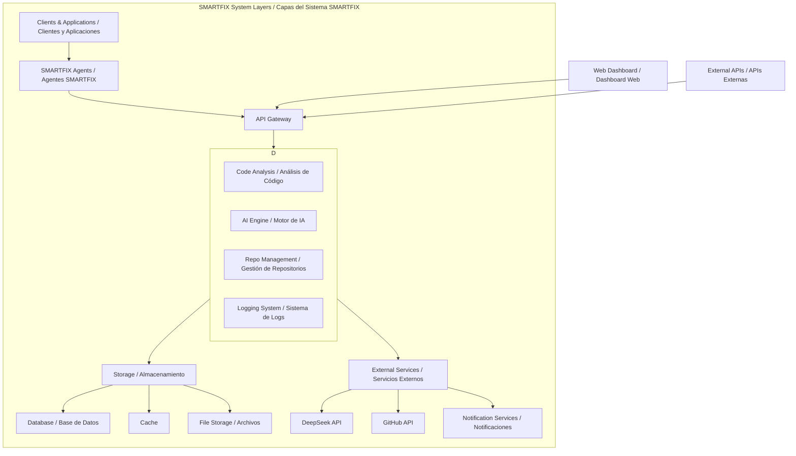
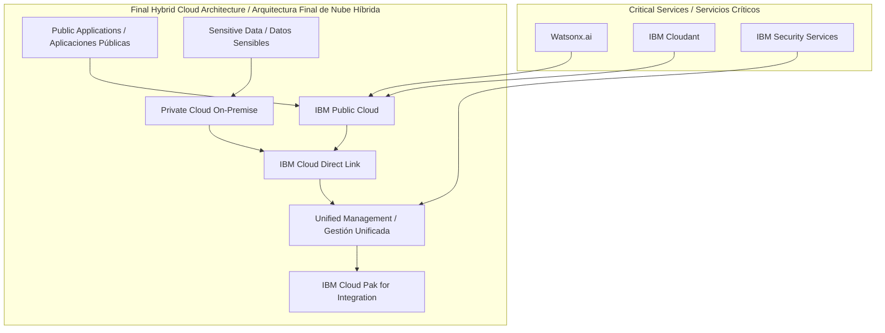

# SMARTFIX TOOL ENFORCEMENT

## 📋 Project Description / Descripción del Proyecto

**ENGLISH:**  
SMARTFIX TOOL ENFORCEMENT is an advanced self-healing code system that uses artificial intelligence to automatically detect, diagnose, and fix software errors. It integrates static and dynamic analysis, machine learning, and natural language processing to deliver precise solutions with minimal human intervention.

**ESPAÑOL:**  
SMARTFIX TOOL ENFORCEMENT es un sistema avanzado de autorreparación de código que utiliza inteligencia artificial para detectar, diagnosticar y corregir errores en aplicaciones de software de forma automática. Integra análisis estático y dinámico, machine learning y procesamiento de lenguaje natural para ofrecer soluciones precisas con mínima intervención humana.

**Author / Autor:** Marcos Mora  
**Copyright:** © 2024 Marcos Mora. All rights reserved / Todos los derechos reservados.

---

## 🚫 License & Protection / Licencia y Protección

**ENGLISH:**  
SMARTFIX TOOL ENFORCEMENT is proprietary software protected by:
- Venezuelan Intellectual Property Law (LOPPI)
- International copyright treaties
- Protected trade secrets and know-how
- International patent process in progress

**Strictly prohibited:**
- Unauthorized distribution
- Reverse engineering
- Unlicensed use
- Unauthorized modification

**ESPAÑOL:**  
SMARTFIX TOOL ENFORCEMENT es software propietario protegido por:
- Ley Venezolana de Propiedad Intelectual (LOPPI)
- Tratados internacionales de derecho de autor
- Secreto comercial y know-how protegido
- Proceso de patente internacional en curso

**Prohibido estrictamente:**
- Distribución no autorizada
- Ingeniería inversa
- Uso sin licencia
- Modificación no autorizada

---

## 🔍 Use Cases / Casos de Uso

**ENGLISH:**  
1. **Automatic Error Detection and Correction**
   - Real-time bug identification
   - Automatic correction with human approval
   - Multi-language support
2. **Intelligent GitHub Fork Management**
   - Automatic code analysis in forked repos
   - Code improvement with compatibility maintenance
   - Automatic Pull Request generation
3. **Continuous Application Monitoring**
   - Proactive problem detection
   - Performance and code quality analysis
   - Smart alerts with prioritization
4. **Automated Documentation**
   - Detailed changelog generation
   - Documentation of changes and improvements
   - Compliance and audit reports

**ESPAÑOL:**  
1. **Detección y Corrección Automática de Errores**
   - Identificación de bugs en tiempo real
   - Corrección automática con aprobación humana
   - Soporte para múltiples lenguajes
2. **Gestión Inteligente de Forks de GitHub**
   - Análisis automático de código en forks
   - Mejora de código con compatibilidad
   - Generación automática de Pull Requests
3. **Monitoreo Continuo de Aplicaciones**
   - Detección proactiva de problemas
   - Análisis de rendimiento y calidad
   - Alertas inteligentes y priorizadas
4. **Documentación Automatizada**
   - Generación de changelogs detallados
   - Documentación de cambios y mejoras
   - Reportes de cumplimiento y auditoría

---

## 💻 Supported Languages and Technologies / Lenguajes y Tecnologías Soportados

**ENGLISH:**  
### Supported Languages
- Python 3.9+
- JavaScript/TypeScript
- Java
- Go
- PHP

### Main Frameworks & Libraries
- Python: Django, Flask, FastAPI, Pandas, NumPy, Scikit-Learn, PyTorch, TensorFlow
- JavaScript/Node.js: Express.js, React, Vue.js, Angular, NestJS
- Java: Spring Boot, Hibernate, Maven/Gradle

### Scale to Other Languages
- C/C++
- C#
- Ruby
- Rust
- Kotlin
- Swift

**ESPAÑOL:**  
### Lenguajes Soportados
- Python 3.9+
- JavaScript/TypeScript
- Java
- Go
- PHP

### Frameworks y Librerías Principales
- Python: Django, Flask, FastAPI, Pandas, NumPy, Scikit-Learn, PyTorch, TensorFlow
- JavaScript/Node.js: Express.js, React, Vue.js, Angular, NestJS
- Java: Spring Boot, Hibernate, Maven/Gradle

### Escalabilidad a Otros Lenguajes
- C/C++
- C#
- Ruby
- Rust
- Kotlin
- Swift

---

## 🔄 Development Methodology (SDLC Agile IBM) / Metodología de Desarrollo (SDLC Ágil IBM)

**ENGLISH:**  
SMARTFIX TOOL ENFORCEMENT follows IBM’s Agile SDLC framework, combining agile best practices and strict quality controls.

**Principles:**
- Iterative and incremental development
- Continuous collaboration
- Integrated testing from the start
- Proactive risk management
- Quality integrated in every phase

**Current PaaS/CaaS Strategy**
- PaaS (IBM Cloud Code Engine): Managed deployment, autoscaling, CI/CD, patching
- CaaS (IBM Kubernetes Service): Docker orchestration, managed clusters, load balancing, multi-region deployment

**Managed Services:**
- IBM Databases for PostgreSQL
- IBM Cloud Object Storage
- IBM Cloudant
- IBM Event Streams
- IBM Watsonx.ai

**ESPAÑOL:**  
SMARTFIX TOOL ENFORCEMENT sigue el marco SDLC Ágil de IBM, combinando mejores prácticas ágiles y controles de calidad rigurosos.

**Principios:**
- Desarrollo iterativo e incremental
- Colaboración continua
- Pruebas integradas desde el inicio
- Gestión proactiva de riesgos
- Calidad integrada en cada fase

**Estrategia PaaS/CaaS Actual**
- PaaS (IBM Cloud Code Engine): Despliegue gestionado, escalado automático, CI/CD, parches
- CaaS (IBM Kubernetes Service): Orquestación Docker, clusters gestionados, balanceo de carga, despliegue multi-región

**Servicios Gestionados:**
- IBM Databases for PostgreSQL
- IBM Cloud Object Storage
- IBM Cloudant
- IBM Event Streams
- IBM Watsonx.ai

---

## 📈 Current Stage: Alpha Phase / Etapa Actual: Fase Alfa

**ENGLISH:**
1. **Planning (Sprint 0) - COMPLETED**
   - Requirements and architecture
   - Patent plan
   - Feasibility study
2. **Development (Sprints 1-4) - IN PROGRESS**
   - Core system
   - Watsonx.ai AI integration
   - Basic dashboard (IBM Carbon Design System)
   - Audit with IBM Instana
3. **Alpha Testing - COMING SOON**
   - Unit, security, and performance tests

**Next Stages:**
- Beta Phase: User testing
- Omega Phase: Hybrid implementation and stabilization
- Production Phase: Commercial launch

**ESPAÑOL:**
1. **Planificación (Sprint 0) - COMPLETADO**
   - Requisitos y arquitectura
   - Plan de patente
   - Estudio de viabilidad
2. **Desarrollo (Sprints 1-4) - EN PROGRESO**
   - Núcleo del sistema
   - Integración con Watsonx.ai
   - Dashboard básico (IBM Carbon Design System)
   - Auditoría con IBM Instana
3. **Pruebas Alfa - PRÓXIMAMENTE**
   - Pruebas unitarias, de seguridad y rendimiento

**Próximas Etapas:**
- Fase Beta: Pruebas con usuarios
- Fase Omega: Implementación híbrida y estabilización
- Fase Producción: Lanzamiento comercial

---

## ☁️ Cloud Infrastructure / Infraestructura en la Nube

**ENGLISH:**  
Main Platform: IBM Cloud

**Used Services:**
- Processing & Storage: IBM Cloud Virtual Servers, Object Storage, Block Storage
- Databases: IBM Cloudant, Db2 on Cloud, Databases for PostgreSQL
- AI: Watsonx.ai, Watson Assistant, Watson Natural Language Understanding
- Development & APIs: IBM API Connect, Code Engine, Cloud Functions
- Monitoring & Management: IBM Instana, Cloud Monitoring, Log Analysis

**ESPAÑOL:**  
Plataforma Principal: IBM Cloud

**Servicios Utilizados:**
- Procesamiento y Almacenamiento: IBM Cloud Virtual Servers, Object Storage, Block Storage
- Bases de Datos: IBM Cloudant, Db2 on Cloud, Databases for PostgreSQL
- IA: Watsonx.ai, Watson Assistant, Watson Natural Language Understanding
- Desarrollo y APIs: IBM API Connect, Code Engine, Cloud Functions
- Monitoreo y Gestión: IBM Instana, Cloud Monitoring, Log Analysis

---

## 🏗️ System Architecture / Arquitectura del Sistema



---

## 🏢 Hybrid Cloud Strategy / Estrategia de Nube Híbrida

**ENGLISH:**  
After Omega phase, SMARTFIX TOOL ENFORCEMENT migrates to a hybrid cloud architecture:

**ESPAÑOL:**  
Al finalizar la Fase Omega, SMARTFIX TOOL ENFORCEMENT migra a arquitectura de nube híbrida:



---

## 🚀 Deployment Flow / Flujo de Despliegue

### Alpha Environment (IBM Cloud Development) / Entorno Alfa (Desarrollo)

```yaml
# IBM Cloud Code Engine configuration
applications:
- name: smartfix-api-alpha
  image: icr.io/smartfix/api:alpha
  runtime: python39
  resources:
    cpu: 2
    memory: 4GB
  services:
    - smartfix-db-alpha
    - smartfix-cache-alpha

# IBM Cloud Database for PostgreSQL
services:
- name: smartfix-db-alpha
  plan: standard
  type: databases-for-postgresql

# IBM Cloud Databases for Redis
- name: smartfix-cache-alpha
  plan: standard
  type: databases-for-redis
```

### Beta Environment (IBM Cloud Testing) / Entorno Beta (Pruebas)

```sh
# IBM Cloud CLI commands for beta deployment
ibmcloud ce application create --name smartfix-beta \
  --image icr.io/smartfix/api:beta \
  --env ENV=beta \
  --bind smartfix-db-beta \
  --bind smartfix-cache-beta \
  --cpu 4 \
  --memory 8GB \
  --min-scale 1 \
  --max-scale 5
```

### Omega Environment (Hybrid Production) / Entorno Omega (Producción Híbrida)

```hcl
# IBM Cloud Terraform configuration for hybrid deployment
module "smartfix_hybrid" {
  source = "github.com/ibm-cloud-architecture/terraform-ibm-smartfix"
  
  region          = "us-south"
  cluster_name    = "smartfix-omega"
  db_instance     = "db2-enterprise"
  cache_nodes     = 3
  min_nodes       = 5
  max_nodes       = 20
  private_cloud   = true
  direct_link     = true
}
```

---

## 📊 Monitoring & Logs System / Sistema de Monitoreo y Logs

**ENGLISH:**  
SMARTFIX TOOL ENFORCEMENT uses IBM Cloud services for comprehensive monitoring:
- IBM Instana for APM: Real-time monitoring, auto dependency detection, AI performance analysis
- IBM Cloud Monitoring: Platform metrics, custom dashboards, smart alerts
- IBM Cloud Log Analysis: Centralized aggregation, advanced search & analysis, configurable retention

### Log Structure / Estructura de Logs

```json
{
  "timestamp": "2024-01-15T10:30:45.000Z",
  "level": "INFO",
  "service": "code-analyzer",
  "event": "analysis_completed",
  "correlation_id": "corr_123456",
  "details": {
    "repository": "https://github.com/user/repo",
    "issues_found": 12,
    "analysis_duration": "45.2s"
  },
  "ibm_cloud_region": "us-south",
  "ibm_resource_group": "smartfix-development"
}
```

**ESPAÑOL:**  
SMARTFIX TOOL ENFORCEMENT utiliza servicios de IBM Cloud para monitoreo integral:
- IBM Instana para APM: Monitoreo en tiempo real, detección automática de dependencias, análisis de rendimiento con IA
- IBM Cloud Monitoring: Métricas, dashboards personalizados, alertas inteligentes
- IBM Cloud Log Analysis: Agregación centralizada, búsqueda y análisis avanzado, retención configurable

---

## 🔐 Security & Compliance / Seguridad y Cumplimiento

**ENGLISH:**  
### Protection Measures
- IBM Cloud Security and Compliance Center: Unified security management
- IBM Cloud Hyper Protect Crypto Services: FIPS 140-2 Level 4 encryption
- IBM Security Verify: Access and identity management
- IBM QRadar: SIEM for threat detection

### Certifications & Compliance
- SOC 1, SOC 2, SOC 3
- ISO 27001, 27017, 27018
- GDPR compliant
- HIPAA ready

**ESPAÑOL:**  
### Medidas de Protección
- IBM Cloud Security and Compliance Center: Gestión unificada de seguridad
- IBM Cloud Hyper Protect Crypto Services: Cifrado FIPS 140-2 Nivel 4
- IBM Security Verify: Gestión de acceso e identidad
- IBM QRadar: SIEM para detección de amenazas

### Certificaciones y Cumplimiento
- SOC 1, SOC 2, SOC 3
- ISO 27001, 27017, 27018
- Cumplimiento GDPR
- Listo para HIPAA

---

## 🌐 Development Roadmap / Roadmap de Desarrollo

**ENGLISH:**
**Q1 2024: Alpha Phase (IBM Cloud Development)**
- Core analysis engine with Watsonx.ai
- Basic GitHub integration via IBM API Connect
- Centralized log system
- Basic admin dashboard

**Q2 2024: Beta Phase (IBM Cloud Testing)**
- Support for more languages
- Human approval system with Watson Assistant
- Performance improvements via IBM Instana
- User testing with IBM Cloud Testing Services

**Q3 2024: Omega Phase (Hybrid Cloud Transition)**
- Migration to hybrid architecture
- Advanced features
- Resource optimization with IBM Turbonomic
- Scalability preparation

**Q4 2024: Commercial Launch**
- Stable v1.0 in hybrid production
- Enterprise support via IBM Cloud for Financial Services
- Market expansion

**ESPAÑOL:**
**Q1 2024: Fase Alfa (Desarrollo IBM Cloud)**
- Núcleo de análisis con Watsonx.ai
- Integración básica con GitHub (IBM API Connect)
- Sistema de logs centralizado
- Dashboard básico de administración

**Q2 2024: Fase Beta (Pruebas IBM Cloud)**
- Soporte para más lenguajes
- Sistema de aprobaciones humanas (Watson Assistant)
- Mejoras de rendimiento con IBM Instana
- Pruebas con usuarios (IBM Cloud Testing Services)

**Q3 2024: Fase Omega (Transición Híbrida)**
- Migración a arquitectura híbrida
- Características avanzadas
- Optimización de recursos (IBM Turbonomic)
- Preparación para escalabilidad

**Q4 2024: Lanzamiento Comercial**
- Versión 1.0 estable en producción
- Soporte empresarial (IBM Cloud for Financial Services)
- Expansión a nuevos mercados

---

## 📞 Support & Contact / Soporte y Contacto

**ENGLISH:**  
For more information about SMARTFIX TOOL ENFORCEMENT, licenses, or collaboration opportunities:

- **Contact:** Marcos Mora
- **Email:** legal@smartfix.dev
- **Location:** Caracas, Venezuela

**Tech Partner:** IBM Cloud  
**IBM Cloud Resources:** [https://www.ibm.com/es-es/cloud](https://www.ibm.com/es-es/cloud)  
**IBM SDLC Agile:** [https://www.ibm.com/think/topics/sdlc](https://www.ibm.com/think/topics/sdlc)

> Legal Notice: This document and its information are intellectual property of Marcos Mora. Unauthorized reproduction, distribution, or use is prohibited under Venezuelan law and international copyright treaties.

© 2024 Marcos Mora. All rights reserved.

*Infrastructure provided by IBM Cloud during development and testing phases. Production deployment will use a hybrid cloud architecture to ensure security and data sovereignty.*

**ESPAÑOL:**  
Para más información sobre SMARTFIX TOOL ENFORCEMENT, licencias o colaboración:

- **Contacto:** Marcos Mora
- **Email:** legal@smartfix.dev
- **Ubicación:** Caracas, Venezuela

**Socio Tecnológico:** IBM Cloud  
**Recursos IBM Cloud:** [https://www.ibm.com/es-es/cloud](https://www.ibm.com/es-es/cloud)  
**IBM SDLC Agile:** [https://www.ibm.com/think/topics/sdlc](https://www.ibm.com/think/topics/sdlc)

> Aviso Legal: Este documento y su información son propiedad intelectual de Marcos Mora. Prohibida la reproducción, distribución o uso no autorizado bajo la ley venezolana y tratados internacionales de copyright.

© 2024 Marcos Mora. Todos los derechos reservados.

*Infraestructura proporcionada por IBM Cloud durante las fases de desarrollo y pruebas. La producción utilizará arquitectura híbrida para garantizar seguridad y soberanía de datos.*

---

## 🔄 Full Workflow / Flujo de Trabajo Completo

```mermaid
graph TB
    subgraph "SMARTFIX Workflow / Flujo de Trabajo SMARTFIX"
        A[Error Detection / Detección de Error] --> B[AI Analysis / Análisis con IA]
        B --> C[Solution Generation / Generación de Solución]
        C --> D{Approval Needed? / ¿Aprobación Requerida?}
        D -->|Yes / Sí| E[Approval Request / Solicitud de Aprobación]
        D -->|No| F[Apply Solution / Aplicar Solución]
        E --> G{Approved? / ¿Aprobado?}
        G -->|Yes / Sí| F
        G -->|No| H[Register Rejection / Registrar Rechazo]
        F --> I[Run Tests / Ejecutar Tests]
        I --> J{Tests Passed? / ¿Tests Pasados?}
        J -->|Yes / Sí| K[Commit and Push]
        J -->|No| L[Revert Changes / Reversar Cambios]
        K --> M[Create Pull Request]
        M --> N[Document in Changelog]
        N --> O[Notify Result / Notificar Resultado]
    end    
    
    subgraph "GitHub Integration / Integración GitHub"
        P[Forked Repository / Repositorio Fork] --> Q[Code Analysis / Análisis de Código]
        Q --> R[Automatic Improvements / Mejoras Automáticas]
        R --> S[Pull Request to Original / Pull Request al Original]
    end
```


